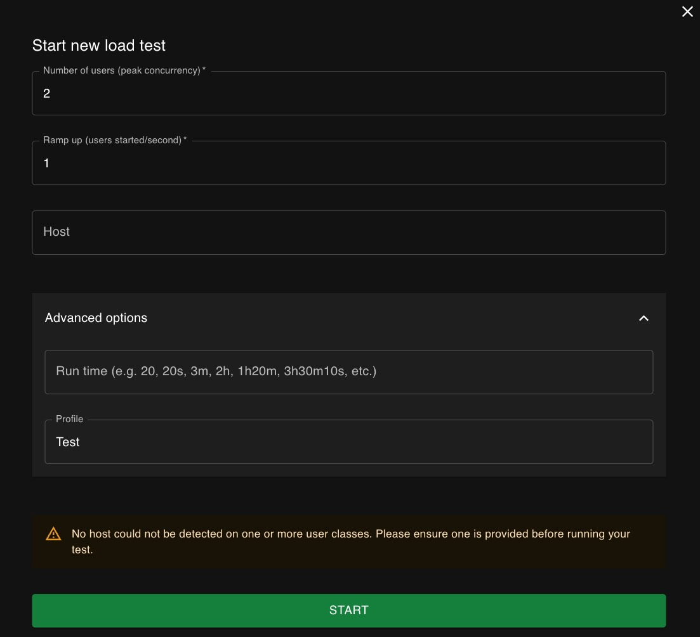

### Contents

**&rarr; [환경 설정](#환경-설정)**

**&rarr; [Load Test](#load-test)**

> **&rarr; [Preloading collection](#preloading-data)**  
> **&rarr; [Load Test](#load-test)**

**&rarr; [OLTP Test](#oltp-test)**

> **&rarr; [Preloading OLTP collection](#preloading-oltp-collection)**  
> **&rarr; [OLTP Test](#oltp-test-1)**

**&rarr; [평가](#evaluation)**

---

## 환경 설정

### Prerequisites

- docker
- docker-compose
- git
- tee

### 기본 테스트

- clone this repo to a local host(load tester)
- `cd mloadtest`
- create a `.env` file
- add `CLUSTER_URL=<MongoDB connection URI>` to _.env_ file
  > _eg._ `CLUSTER_URL=mongodb+srv://<db_username>:<db_password>@up.icpitla.mongodb.net/?retryWrites=true&w=majority&minPoolSize=100&maxPoolSize=100` for Atlas
- add `ARCH=arm64|amd64` to _.env_ file
  > default: `amd64`
- `docker-compose -f docker-compose.envcheck.yml up -d`
- open `http://<locust host>:8089` in a browser



- configure
  - `Number of users`
  - `Ramp up` (how long it will take to load total users in seconds)
  - `Host`: **무시**
  - Advanced options
    - `Run time`
    - `Profile`: short description for this run
- click on `START`

### Logging

To redirect container logging to both `stdout` & a file

> `docker logs -f <container name> 2>&1 | tee <log file name>`

### Terminate

`docker-compose -f docker-compose.envcheck.yml down`

---

## Load Test

### Preloading data

Default size: `20`GB  
To adjust the total size to load

> add `SCAN_COLL_FILLSZ_GB=<size in GB>` to `.env` file

#### Steps

- `docker-compose -f docker-compose.envcheck.yml up -d`
- `docker exec -it alone /bin/bash`
- `python prepare_scancoll.py`

`loadtest.scancoll`(db.coll) is created and loaded with docs up to the given total size(default: `20`GB) <br>
Each doc is `512`B in bson size

---

### Load Test

#### Settings

Add the following variables to `.env` file (default value is applied if not set)

- `NWORKERS`: number of test clients to run concurrently (default: `8`)
- `DOCS_PER_BATCH`: number of docs to insert in one batch via `insert_many` (default: `10`)
- `CLUSTER_URL`: target MongoDB connection URI  
  _Options_:
  > - `minPoolSize` & `maxPoolSize` to let connection handshakes not impact the warming-up performance.
  >
  >   > _eg._ `mongodb+srv://<domain name>/?minPoolSize=<value>&maxPoolSize=< >=value>`
  >   >
  >   > - minPoolSize `<=` maxPoolSize
  >   > - value `==` number of users per worker (total users/`NWORKERS`)
  >
  > - `readPreference=secondary`
  >
  >   > _eg._ `mongodb+srv://<domain name>/?minPoolSize=<min>&maxPoolSize=<max>&readPreference=secondary`
  >
  > - `readPreferenceTags`
  >   > choose primary & one secondary to funnel read queries to one secondary only  
  >   > use `readPreference=secondary` together  
  >   > _eg._ `mongodb+srv://<doamin name>/?minPoolSize=<min>&maxPoolSize=<max>&readPreference=secondary&readPreferenceTags=availabilityZone:apne-az1&readPreferenceTags=availabilityZone:apne-az2`  
  >   > use `rs.conf()` to identify nodes & tags

_Optional_:

> if `run_tests.sh` is not executable  
> do `chmod a+x run_tests.sh`

#### Run

- `./run_tests.sh` <br>
  then select test scenario

```
 1:    doc_size: 512B , R:  0% , W: 100%
 2:    doc_size:   1K , R:  0% , W: 100%
 3:    doc_size:  10K , R:  0% , W: 100%
 4:    doc_size: 100K , R:  0% , W: 100%
 5:    doc_size: rand , R:  0% , W: 100%

11:    doc_size: 512B , R: 50% , W:  50%
12:    doc_size:   1K , R: 50% , W:  50%
13:    doc_size:  10K , R: 50% , W:  50%
14:    doc_size: 100K , R: 50% , W:  50%
15:    doc_size: rand , R: 50% , W:  50%

21:    doc_size: 512B , R: 95% , W:   5%
22:    doc_size:   1K , R: 95% , W:   5%
23:    doc_size:  10K , R: 95% , W:   5%
24:    doc_size: 100K , R: 95% , W:   5%
25:    doc_size: rand , R: 95% , W:   5%

 0:    insert random docs in size while doing collection scan
       size = 512B | 1K | 10K | 100K
```

- open `http://<host>:8089`
- set values

  - `Number of users`

    > total users to run concurrently that is evenly distributed across workers  
    > `2` for test **0**(inserts while doing collection scan)  
    > `N` for the rest test scenarios

  - `Ramp up`

    > how many users to start per second  
    > if Number of users=`1000` & Ramp up=`10`, it takes `100`s to start all 1000 users  
    > **&excl;** Must **Not** be `> 100/worker`. In other words, if `NWORKERS=8` in `.env` file, **Ramp up** should be `<= 800`.

  - `Host` (**ignore**)
  - `Runtime`
  - `Profile` (**ignore**)

- click on `START`


#### Logging

A log file named `<profile name>.<YYYYmmdd>T<HHMMSS>.log` will be put in the folder

## OLTP Test

### Preloading OLTP collection

Default size: `10`GB

#### Steps

- `docker-compose -f docker-compose.envcheck.yml up -d`
- `docker exec -it alone /bin/bash`
- `python prepare_oltpcoll.py`

`loadtest.oltp`(db.coll) is created and loaded with docs up to the given total size(default: `10`GB) <br>
Each doc is `2`KB in bson size

### OLTP Test

Check [Settings](#settings)

- `./run_oltp_tests.sh` <br>
  then select test scenario

```
 1     4K W: 50% , 2K R: 50%
 2     8K W: 50% , 2K R: 50%
 3    16K W: 50% , 2K R: 50%
 4    32K W: 50% , 2K R: 50%
 5    64K W: 50% , 2K R: 50%
```

---

## Evaluation

### Peak Concurrency

For all tests except test`0`, set `Number of users` to big enough number(_eg._ 5000)  
and see in the Locust `CHARTS` when throughput starts to stall or response time increases.

> test`0` needs 2 users only
>
> - one for inserts(512B)
> - the other for collection scan

### Overall Performance

For each test, check Locust `STATISTICS`

```
ops, #reqs, #fails, times(ms), avg size, RPS, #fails/s
```

### Failover

While running any test, let the Primary **step down** voluntarily  
and see if failover perfomrs gracefully  
and also see if ops record any failure in Locust `STATISTICS` or `CHARTS` right after step-down.
